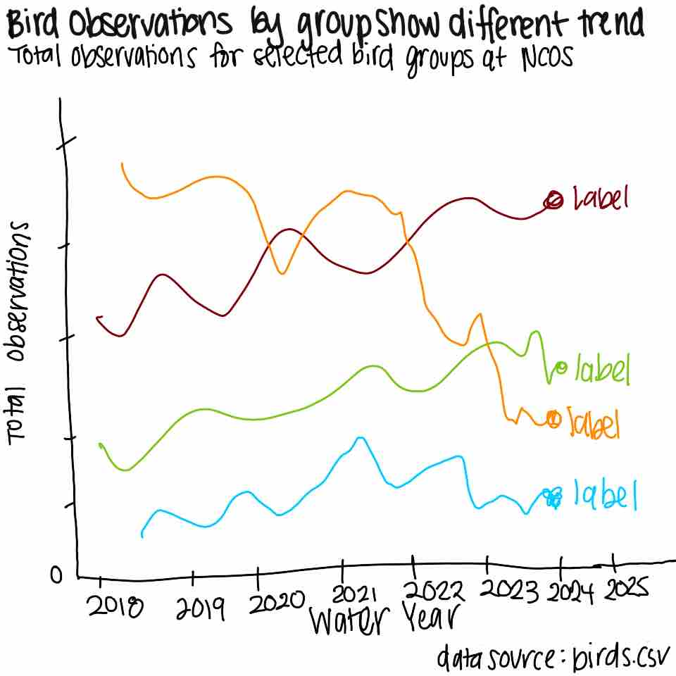

# Set up

## Packages
```{r}
#| label: packages

# reads in tidyverse package from library 
library(tidyverse)
# reads in janitor package from library 
library(janitor)
# reads in here package from library 
library(here)
# reads in scales package from library 
library(scales)
# reads in NatParksPalettes package from library 
library(NatParksPalettes)
# reads in ggrepel package from library 
library(ggrepel)
```
## Data
```{r}
#| label: data
# reads in eBird data as birds
birds <- read_csv(here("data", "birds.csv"))
```

# 1. Explain your inspiration
:::{.callout-note}
In 1-2 sentences each, describe:

which visualization you chose for your inspiration
why it makes sense for your dataset of choice
which variables from your dataset will be shown in your visualization, and what visual components they map onto (axes, shapes, colors, etc.)
:::
**Which visualization you chose for your inspiration**: For my inspiration, I chose Steven Ponce's ["Coal falls. Renewables rise."](https://stevenponce.netlify.app/data_visualizations/30DayChartChallenge/2026/30dcc_2026_24.html) visualization because it uses a clean time-series design to show change over time which was visually appealing to me. I am applying that same idea to bird survey data by showing how observed bird counts change across water years. 

**Why it makes sense for your dataset of choice**: This inspiration makes sense for my dataset because the observations in the Ebird data are naturally time-based so a time-series figure can show whether selected species increased, decreased, or stayed stable over time. Instead of showing energy sources over time (like Steven Ponce's origional does), my figure will show selected bird species observed at NCOS over time.

**Which variables from your dataset will be shown in your visualization, and what visual components they map onto (axes, shapes, colors, etc.)**: The variables in shown in my figure will be `water_year` (found from origional `date` column), `e_bird_group`, and `count` (summed to `total_observations`). Water year will be on the x-axis, total observations will be on the y-axis, species will determine line and point color color, and there will be labels to identify each species group at the end of its line.


# 2. Plan your figure
:::{.callout-note}
Sketch what your figure would look like following your inspiration.

Insert that sketch (as a photo, screenshot, or otherwise) into your document.

:::
```{r}
#| echo: false

```

# 3. Code your figure
:::{.callout-note}
Clean/wrangle your data as needed.

Then, code the figure you decided to create.

Make sure all your code is annotated, and that the output is showing.

At the end of this section, include code to save your final figure as a .jpg or .png file.
:::
## Data cleaning/wrangling
```{r}
#| label: data cleaning/wrangling

# creates new object birds_clean from birds that has standardized column names
birds_clean <- birds |> clean_names()

# creates new object birds_wrangled from birds_clean
birds_wrangled <- birds_clean |>
  # converts observation_date into Date format
  mutate(observation_date = as.Date(observation_date)) |>
  # filter to include:
  filter(# observations that are not repeats
         repeat_observation == "No",
         # eBird groups in the 4 groups of interest
         e_bird_group %in% c("Waterfowl",
                             "New World Sparrows",
                             "Herons, Ibis, and Allies", 
                             "Shorebirds")) |>
  # creates a new column `water_year` assigning each observation to a water year
  mutate(water_year = case_when(
    observation_date > "2017-09-30" & observation_date < "2018-10-01" ~ 2018,
    observation_date > "2018-09-30" & observation_date < "2019-10-01" ~ 2019,
    observation_date > "2019-09-30" & observation_date < "2020-10-01" ~ 2020,
    observation_date > "2020-09-30" & observation_date < "2021-10-01" ~ 2021,
    observation_date > "2021-09-30" & observation_date < "2022-10-01" ~ 2022,
    observation_date > "2022-09-30" & observation_date < "2023-10-01" ~ 2023,
    observation_date > "2023-09-30" & observation_date < "2024-10-01" ~ 2024,
    observation_date > "2024-09-30" & observation_date < "2025-10-01" ~ 2025)) |>
  # groups observations by e_bird_group & water year 
  group_by(e_bird_group, water_year) |>
  # sums total observations for each e_bird_group in each water year
  summarize(total_observations = sum(count)) |>
  # ungroup df 
  ungroup()
```
## Code the figure
```{r}
#| label: figure prep
# creates object labels from birds_wrangled for labeling each e_bird_group line
labels <- birds_wrangled |>
  # groups by e_bird_group
  group_by(e_bird_group) |>
  # sets the column water_year to be the max water year recorded
  filter(water_year == max(water_year)) |>
  # ungroup df 
  ungroup()
```

```{r}
#| label: code the figure
#| fig-width: 8
#| fig-height: 5
# base layer: ggplot
bird_plot <- ggplot( # assigns plot to object bird_plot 
  birds_wrangled, # uses birds_wrangled data frame
  aes(x = water_year, # x-axis is water_year
      y = total_observations, # y-axis is total_observations
      color = e_bird_group, # color determined by e_bird_group 
      group = e_bird_group)) + # groups by e_bird_group
  # first layer: horizontal grid reference lines at 50 observation increments
  geom_hline(yintercept = seq(0, max(birds_wrangled$total_observations), by = 50),
             color = "gray80", # colors lines grey
             linewidth = 0.3) + # line width is 0.3
  # second layer: lines for each e_bird_group
  geom_line(linewidth = 1.3) + # line width is 1.3
  # third layer: points for each water year
  geom_point(size = 2.5) + # size is 2.5
  # fourth layer: labels for the last value of each line 
  geom_text_repel(data = labels, # uses labels df
                  aes(label = e_bird_group), # label is e_bird_group
                  nudge_x = 0.25, # pushes labels slightly right
                  direction = "y", # only adjusts vertically
                  hjust = 0, # no horizontal adjustment
                  segment.color = NA, # removes connecting lines
                  size = 3) + # size is 3

  # lenghtens x-axis for label readability
  scale_x_continuous(breaks = 2018:2025, limits = c(2018, 2025.9)) +
  # formats y-axis
  scale_y_continuous() +
  # uses non-default colors
  scale_fill_manual(values = natparks.pals("Torres")) +
  # removes legend 
  guides(color = "none") +
  # creates title
  labs(title = "Bird observations by group show different trends over time",
       # creates subtitle
       subtitle = "Total observations for selected bird groups at NCOS",
       x = "Water Year", # labels x-axis
       y = "Total Observations", # labels x-axis
       caption = "Data source: birds.csv" ) + # creates caption identifying source
  # applies non-default theme
  theme_minimal() +
  # customizes theme for readability
  theme(plot.title = element_text(face = "bold", size = 14), # formats title
        plot.subtitle = element_text(size = 11), # formats subtitle
        axis.title = element_text(face = "bold"), # formats axis labels
        panel.grid.minor = element_blank()) # formats gird lines
# shows plot
bird_plot
```
## Save figure
```{r}
#| label: saving figure
ggsave(filename = here("code", "bird_figure.png"), # set file name + location
       plot = bird_plot, # plot to be saved is bird_plot
       width = 8, # width of figure is 8
       height = 5, # height of figure is 5
       dpi = 300) # dpi is 300
```

# 4. Describe your process
:::{.callout-note}
In 1-3 sentences each, describe:

your process of using someone else’s code to create a visualization
challenges you encountered as you made your visualization
how your visualization differs from visualizations you made in class, for assignments, or for a previous elective
:::
**Your process of using someone else’s code to create a visualization**:
I started by examining the inspiration code and identifying its key components, such as the time-series layout, use of lines and points, and direct labeling instead of a legend. If I was confused about elements I first searched them in R Studio and if not searched google for further clarification of their implementation and usage. I then adapted the key elements to my chosen dataset (the birds data set) by modifying the variables, simplifying some components, and rewriting parts of the code to match my data structure/the style and formatting I am comfortable with that we have used in this class.

**Challenges you encountered as you made your visualization**: One major challenge was that my labels overlapped due to the end year values beng similar for waterfowl and sparrows. Since the inspiration code did not deal with this particular issue I had to research elsewhere to figure out how I could maintain the readability of me labels. I ended up using the `ggrepel` package which allowed me to shift the labels.

**How your visualization differs from visualizations you made in class, for assignments, or for a previous elective**: This visualization differs from those I created in class because it focuses more on storytelling and presentation rather than just exploring relationships between variables. It includes a wider range of time which can show more broad patterns. The direct labeling is the main inspiration I took from Steven Ponce's figure that largely differs from previous plots we made in class which I was drawn to because I wanted to learn how to incorporate this for future visualization I create.